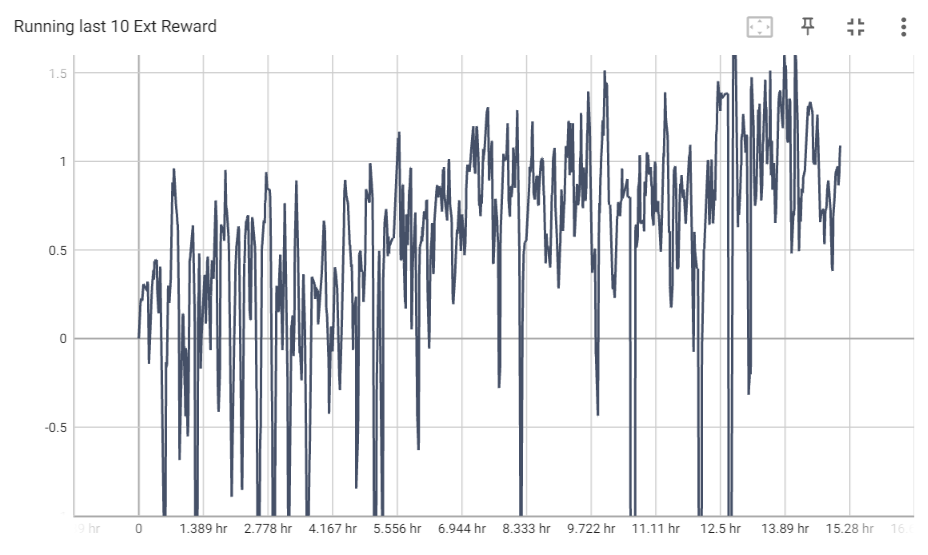
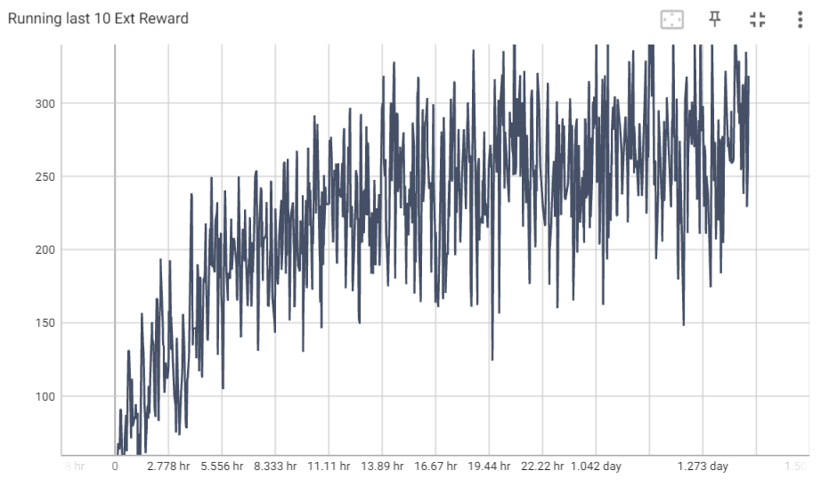
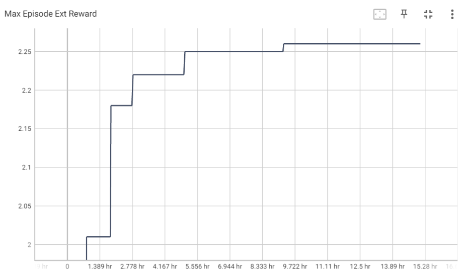
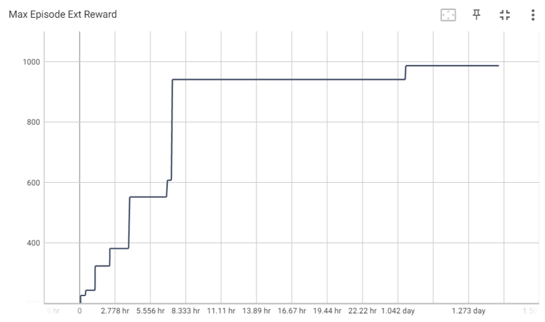
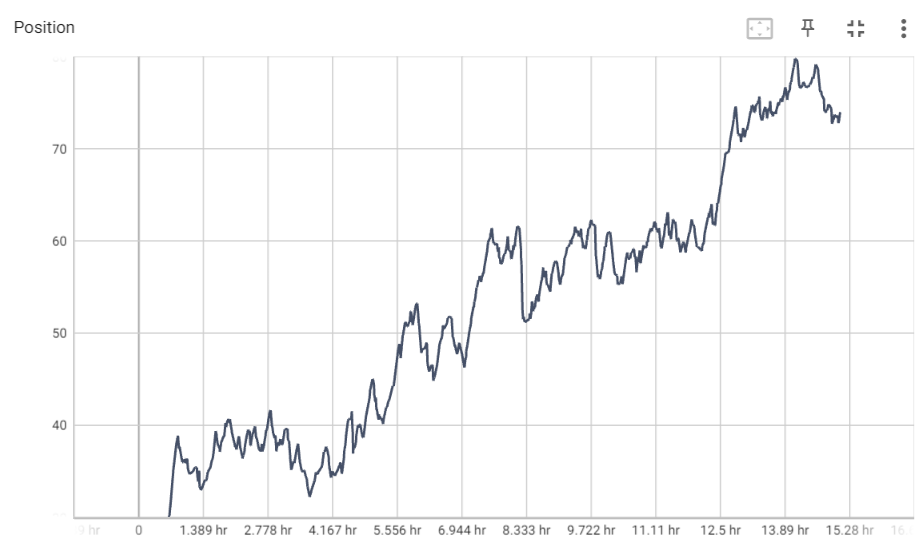
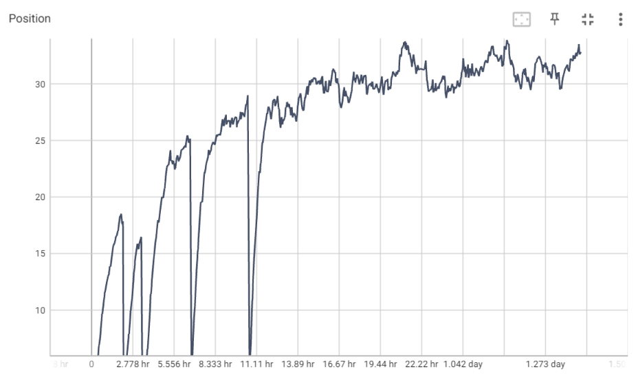
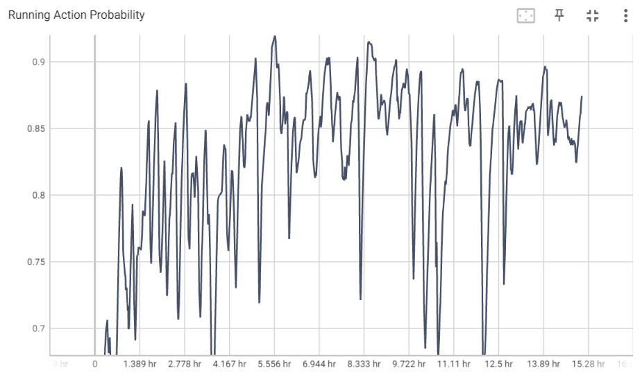
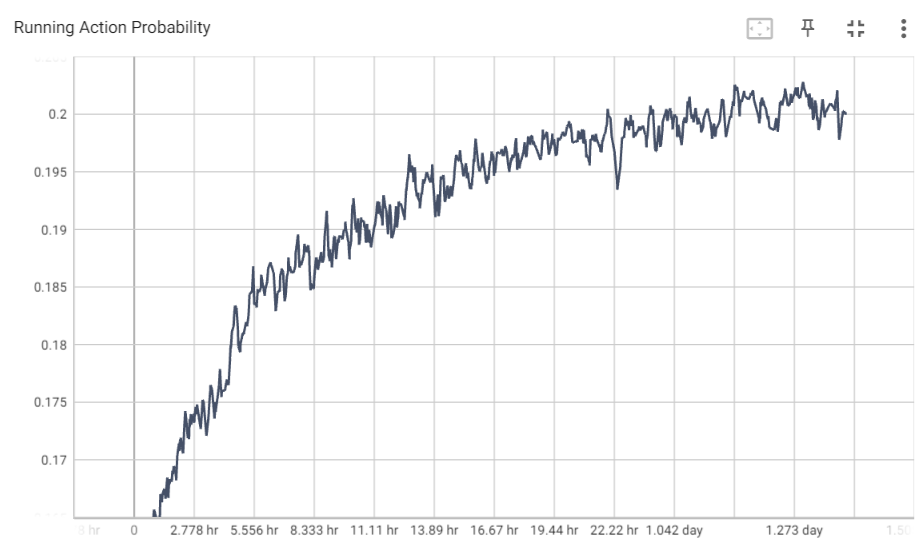

[](http://makeapullrequest.com)  
# Introduction / RL Project

Implementation of the **Exploration by Random Network Distillation** and **Double Deep Q-Learning** on Super Mario Bros NES game and a custom version of Super Mario Bros. This is a RL project for our course.

## Random Network Distillation
The algorithm simply consists of generating intrinsic rewards based on the novelty that the agent faces and using these rewards to reduce the sparsity of the game. The main algorithm to train the agent is **Proximal Policy Optimization** which is able to combine extrinsic and intrinsic rewards easily and has fairly less variance during training.

## Double Deep Q-learning
Q-learning tends to overestimate bias in experiments across different game environments. A solution involves using two separate Q-value estimators, each of which is used to update the other: we have a model Q and a target model Q’. Using these estimators, we can unbiased Q-value estimates of the actions selected. We can
thus avoid maximization bias by disentangling our updates from biased estimates.

## Demo
RND on original environment | RND on our environment | DDQL on our environment
 :-: | :-: | :-:
<video src='https://user-images.githubusercontent.com/104620137/232108067-b4d494bb-3233-4d05-a9d2-9f8da23c548c.mp4' width=180/></video> | <video src='https://user-images.githubusercontent.com/104620137/232101860-e1c08577-25f5-4825-9242-c30f5f28b7f7.mp4' width=180/></video> | <video src='https://user-images.githubusercontent.com/104620137/232231296-6fdacf82-1684-4051-90f3-b0be1af91c10.mp4' width=180/></video>


## Results
RND on our environment | DDQL on our environment
:-----------------------:|:-----------------------:|
	               | 	
	               | 	
	               | 	
	               | 	

## Table of hyper-parameters

> By using the max and skip frames of 4, max frames per episode should be 4500 so 4500 * 4 = 18000 as it has been mentioned in the paper.

Parameters          | Value
:-----------------------:|:-----------------------:
total rollouts per environment  | 30000
max frames per episode  | 4500
rollout length       	       | 128
number of environments| 32
number of epochs	   | 4
number of mini batches  | 4
learning rate                      | 1e-4
extrinsic gamma		    | 0.999
intrinsic gamma		    | 0.99
lambda		                  | 0.95
extrinsic advantage coefficient       | 2
intrinsic advantage coefficient        | 1
entropy coefficient     		    | 0.001
clip range    				       | 0.1
steps for initial normalization	      | 50
predictor proportion		     | 0.25


## Structure
```shell
RL_Project
├── Agent
│   ├── DDQL_agent.py
│   ├── RND_agent.py
│   ├── model.py
│   └── neural.py
├── Common
│   ├── config.py
│   ├── env.py
│   ├── logger.py
│   ├── play.py
│   ├── runner.py
│   └── utils.py
├── demo
│   ├── agent_ddql_our_env.mp4
│   ├── finisher_ddql_our_env.mp4
│   ├── finisher_rnd_nes_env.mp4
│   └── finisher_rnd_our_env.mp4
├── Logs
├── main_ddql.py
├── main_fromscratch_env.py
├── main_original_env.py
├── Models
│   ├── DDQL
│   |   └── 2023-04-13-14-19-52
│   └── RND
│       └── 2023-04-06-00-30-40_nes_env
│       └── 2023-04-06-00-30-40_nes_env
├── playground.py
├── Results
├── README.md
└── requirements.txt

```
1. _Agent_ dir includes the neural networks structures and the agents decision-making core.
2. _Common_ includes minor codes that are common for most RL codes and do auxiliary tasks like: logging, environments, and... .
3. _main_ddql.py_ is the core module of the code that manages all other parts and make the DDQL agent interact with the custom environment.
4. _main_fromscratch_env.py_ is the core module of the code that manages all other parts and make the RND agent interact with the custom environment.
5. _main_original_env.py_ is the core module of the code that manages all other parts and make the RND agent interact with the NES environment.
6. _Models_ includes the pre-trained weights that you can use to play or keep training by it, also every weight is saved in this directory.
## Dependencies
- gym == 0.17.3
- gym-super-mario-bros == 7.3.0
- keyboard == 0.13.5
- matplotlib == 3.3.2
- numpy == 1.19.2
- opencv_contrib_python == 4.4.0.44
- torch == 1.6.0
- tqdm == 4.50.0

## Installation
```shell
pip3 install -r requirements.txt
```
## Usage
### How to run
```bash
usage: main.py (replace by one the 3 main python file you want to run) [-h] [--n_workers N_WORKERS] [--interval INTERVAL] [--do_test]
               [--render] [--train_from_scratch]

Variable parameters based on the configuration of the machine or user's choice

optional arguments:
  -h, --help            show this help message and exit
  --n_workers N_WORKERS
                        Number of parallel environments.
  --interval INTERVAL   The interval specifies how often different parameters
                        should be saved and printed, counted by iterations.
  --do_train             The flag determines whether to train the agent or play
                        with it.
  --render              The flag determines whether to render each agent or
                        not.
  --train_from_scratch  The flag determines whether to train from scratch or
                        continue previous tries.

```
- **In order to train the agent with default arguments, execute the following command** (You may change the number of workers and the interval based on your desire.):
```shell
python3 main.py --n_workers=128 --interval=100
```
- **If you want to keep training your previous run, execute the following:**
```shell
python3 main.py --n_workers=128 --interval=100 --train_from_scratch
```
- **If you want  the agent to play, execute the following:**
```shell
python3 main.py --do_train
```
### Hardware requirements
- **The training has been performed on a RTX3050 Laptop**.

## References
1. [_Exploration by Random Network Distillation_, Burda et al., 2018](https://arxiv.org/abs/1810.12894)
2. [_Proximal Policy Optimization Algorithms_, Schulman et al., 2017](https://arxiv.org/abs/1707.06347)
3. [_Deep Reinforcement Learning with Double Q-learning_, Hasselt et al.., 2015](https://arxiv.org/abs/1509.06461)
